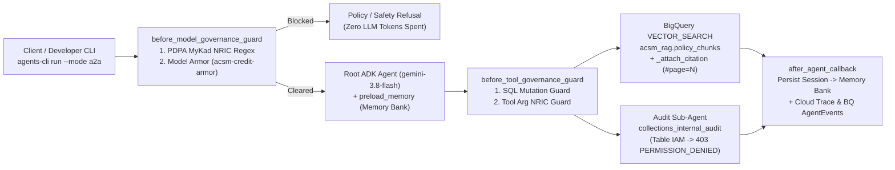
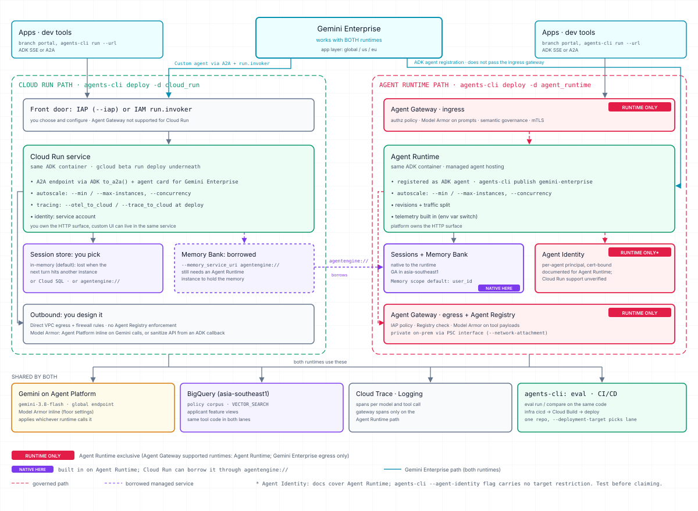

# ACSM agent workshop (full code)

A working ADK agent for AEON Credit policy questions, deployed to Agent Runtime on Gemini Enterprise Agent Platform. It answers from the policy corpus with clickable citations, remembers users across sessions with Memory Bank, screens prompts with Model Armor and a MyKad/PDPA guard, and logs every run for audit.

This is the guided path: the code is complete, you deploy it, talk to it, and read how it works. The build-it-yourself version is the [`acsm-agent-build`](https://github.com/jackychoo-g/acsm-agent-build) repo.

---

## Architecture Overview


### Request Execution Flow in This Lab



### Architectural Pillars: Scalability, Governance, Identity & Operations

#### 1. Scalability & Stateless Compute (`asia-southeast1`)
- **Externalized Conversation State**: Agent Runtime containers hold zero local conversation state. Short-term turn history lives in managed **Sessions**, and long-term user facts live in **Memory Bank** (scoped by `user_id` via `preload_memory` and `after_agent_callback`). Any container instance can serve the next turn of any conversation.
- **Declarative Autoscaling**: Horizontal scaling is controlled via deployment flags (`--min-instances`, `--max-instances`, `--concurrency`, `--cpu`, `--memory`) in [`Makefile`](Makefile) rather than application code. Setting `--min-instances 1` in production eliminates cold starts on live customer channels; `--min-instances 0` in the workshop scales idle participant agents down to zero cost.
- **Canary Revisions & Private On-Premises Reachability**: Agent Runtime supports immutable revisions with traffic splitting for canary rollouts and Private Service Connect (`--network-attachment`) so agents reach on-premises core banking systems (AS400, DB2, SAP) over private VPC peering without public IPs.
- **Model Throughput Ceiling**: Container instances scale horizontally in seconds, making `gemini-3.8-flash` token quota on the `global` endpoint the primary capacity planning metric.

#### 2. Multi-Layer Governance & Defense in Depth
Governance operates at three independent layers so a single misconfigured prompt cannot bypass controls:

| Layer | Enforcement Point | What It Inspects & Blocks | Implementation in Repo |
|---|---|---|---|
| **1. Perimeter Gateway** | **Agent Gateway** (`CLIENT_TO_AGENT` ingress & `AGENT_TO_ANYWHERE` egress) + **Agent Registry** | Caller authorization, mTLS termination, gateway-level Model Armor inspection, and outbound MCP/A2A allowlisting against Agent Registry | [`infra/gateways/`](infra/gateways/) & [`labs/03-agent-gateway.md`](labs/03-agent-gateway.md) |
| **2. Application Callbacks** | **`before_model_governance_guard`** & **`before_tool_governance_guard`** | Instant regex block on unmasked Malaysian MyKad NRIC numbers (`YYMMDD-PB-####`, rule `BNM-RMIT-PDPA-001`), live **Model Armor** (`acsm-credit-armor`) prompt-injection/jailbreak/PII screening, and destructive SQL verb blocking (`DROP`, `DELETE`, `TRUNCATE`, `UPDATE`, `ALTER`) | [`app/governance/policy_guard.py`](app/governance/policy_guard.py) |
| **3. Model Platform Floor** | **Gemini on Agent Platform** (`gemini-3.8-flash`) | Inline safety floor settings enforced on every `generate_content` call | [`app/config.py`](app/config.py) |

#### 3. Identity & Least-Privilege Data Access Boundaries
- **Workshop Shared Service Account vs. Production Agent Identity**:
  - **In this shared-project workshop**: Every participant deploys their own isolated Agent Runtime instance (`acsm-agent-<owner>`) bound to the shared service account `acsm-lab-agent@<project>.iam.gserviceaccount.com`.
  - **Table-Level BigQuery IAM**: That service account holds `roles/bigquery.dataViewer` on `acsm_rag.policy_chunks` (440 embedded chunks across 47 policy documents) and `roles/bigquery.dataEditor` on `adk_agent_analytics.agent_events`, but has **zero permissions** on `acsm_rag.collections_internal_audit`. When the root agent delegates an audit question to `acsm_audit_exception_agent` (`make chat-audit`), BigQuery IAM rejects the query with HTTP `403 Access Denied` and the tool returns a structured `PERMISSION_DENIED` payload explaining the boundary.
  - **In production ([`labs/02-agent-identity.md`](labs/02-agent-identity.md))**: Deploying with `--agent-identity` provisions a dedicated, certificate-bound principal per agent (`principal://...`) so BigQuery table grants are isolated per agent rather than shared across a service account.

#### 4. BigQuery Retrieval & Deterministic Citations
- **BigQuery `VECTOR_SEARCH` ([`app/tools/policy_search.py`](app/tools/policy_search.py))**: Embeds the user query with `gemini-embedding-001` (768 dimensions) and executes cosine `VECTOR_SEARCH` over `acsm_rag.policy_chunks` with optional SQL pre-filtering by `category` and `language`.
- **Deterministic Citation Contract (`_attach_citation`)**: The retrieval tool enriches every returned chunk from [`app/data/doc_manifest.json`](app/data/doc_manifest.json) with a verified `source_url` (`https://storage.cloud.google.com/<bucket>/raw/<file>#page=N`) and pre-formatted `citation_markdown` (`[DOC_ID: Title (vX, eff. YYYY-MM-DD), Clause — Heading](url)`). The LLM is instructed to copy `citation_markdown` verbatim and never invent URLs.

#### 5. Cloud Run vs. Agent Runtime Capability Map



#### 6. Observability, Audit Trail & Release-Gated Evaluation
- **Unredacted OpenTelemetry Tracing**: `ADK_CAPTURE_MESSAGE_CONTENT_IN_SPANS=true` and `OTEL_INSTRUMENTATION_GENAI_CAPTURE_MESSAGE_CONTENT=SPAN_AND_EVENT` record full prompt, tool-call, and completion payloads in **Cloud Trace** (`make trace`).
- **BigQuery Audit Sink**: Every turn writes a structured event row (`owner`, `backend`, `user_id`, `session_id`, `latency_ms`, `status`, `preview`) to `adk_agent_analytics.agent_events` (`make audit-logs`).
- **Evaluation & GEPA Prompt Optimization**: `agents-cli eval run` and `agents-cli eval compare` grade the agent against the golden dataset ([`tests/eval/datasets/acsm_golden.json`](tests/eval/datasets/acsm_golden.json)) across English, Bahasa Malaysia, version-precedence (`POL-CR-001-v2` superseding `v1`), and PDPA/audit-refusal scenarios before promotion.

#### 7. Regional Residency (`asia-southeast1` Singapore vs. `global`)
- **Pinned to `asia-southeast1` (Singapore)**: Agent Runtime compute, Managed Sessions, Memory Bank, BigQuery datasets (`acsm_rag`, `adk_agent_analytics`), Cloud Storage policy bucket (`raw/` PDFs/DOCX/XLSX/HTML), the Model Armor template (`acsm-credit-armor`) and the `acsm-lab-config` secret replica.
- **`global` Endpoint**: `gemini-3.8-flash` model inference (`GOOGLE_CLOUD_LOCATION=global`) and the Gemini Enterprise application layer.

---

## What you need

- A Google account the instructor has added to the workshop project.
- Either **Cloud Shell** (nothing to install; gcloud is already signed in) or a laptop with `git`, `make`, Python 3.11+ and the [gcloud CLI](https://cloud.google.com/sdk/docs/install).

## 1. Sign in: two credentials, not one

gcloud keeps two separate credentials on your machine. The workshop needs both.

| Credential | Set with | Used by |
|---|---|---|
| gcloud CLI credential | `gcloud auth login` | `gcloud ...` commands, `make configure` |
| Application Default Credentials (ADC) | `gcloud auth application-default login` | Python client libraries: the agent code when you run it locally, and `agents-cli deploy` |

A third identity matters once the agent is deployed: it runs as the shared service account `acsm-lab-agent@<project>`, **not** as you. What the agent can read in BigQuery is decided by that service account's grants. You'll see this when the audit-log question comes back `PERMISSION_DENIED`.

```bash
gcloud auth login --update-adc --no-launch-browser   # sets both CLI and ADC credentials in one step
gcloud config set project <workshop-project-id>      # the instructor gives you this
```

`--no-launch-browser` prints a link. Open it, sign in, and paste the code back into the terminal. (On Cloud Shell, where the CLI is already signed in, you can also run `gcloud auth application-default login --no-launch-browser`.)

## 2. Set up

```bash
git clone https://github.com/jackychoo-g/acsm-agent-workshop.git
cd acsm-agent-workshop
make bootstrap    # installs uv and agents-cli into ~/.local/bin, then the Python deps
make configure    # reads workshop settings from Secret Manager into .lab.env
make whoami       # check project, owner and agent name before you deploy
```

`make whoami` shows the name your agent will get: `acsm-agent-<owner>`. The owner defaults to the part of your email before `@`. To pick your own, add `OWNER=<name>` to any command. Use the same name every time, or you'll create a second agent.

## 3. Try it locally

```bash
make search              # BigQuery vector search over policy_chunks
make test-contract       # checks the citation contract, the audit denial and the config
```

Then run the whole agent on your machine before deploying it. Use two terminals:

```bash
make playground          # terminal 1: open http://localhost:8000, pick acsm_bq_rag
make local-chat Q="What is the minimum NDI floor for an applicant with 3 dependants? Cite the source."   # terminal 2
make local-chat Q="Check AEON Platinum Visa eligibility for NRIC 880512-14-5678 earning RM 6,000."       # blocked by the MyKad guard
```

The local agent uses the same code, BigQuery table and Model Armor template as the deployed one. Sessions and memory stay in the playground process until you stop it. Stop it (Ctrl+C) before you deploy.

## 4. Deploy

```bash
make deploy OWNER=<your-name>
```

Takes about 4 minutes. Everyone deploys into the same project, but each agent has its own name, so you never overwrite anyone else's. If it times out, run `make status`: if your agent isn't listed, run `make deploy` again.

## 5. Talk to it

```bash
make chat Q="What is the minimum NDI floor for an applicant with 3 dependants? Cite the source."
make chat Q="Berapakah had maksimum DSR untuk pemohon bergaji RM 4,500 sebulan?"
make chat-audit          # asks for the restricted audit log: expect PERMISSION_DENIED, explained
```

The first call after the agent has been idle can time out while it starts. Run it again.

## 6. Look inside

```bash
make status        # your agent's resource ID, service account and last update
make trace         # links to Cloud Trace, Cloud Logging and the console page for your agent
make memory USER_ID=workshop-user   # what Memory Bank stored for a user
make audit-logs    # your agent's runs from the analytics table, filtered by owner
make test-governance               # Model Armor and MyKad/PDPA guard, run locally
```

Then open [CODE_WALKTHROUGH.md](CODE_WALKTHROUGH.md). It links each step of a request to the exact lines that handle it.

## 7. Evaluate and improve (optional)

```bash
make eval-baseline && make eval-candidate && make eval-compare
make hillclimb-gepa   # prompt optimisation with GEPA, takes several minutes
```

## 8. Clean up

```bash
make cleanup CONFIRM=yes   # deletes acsm-agent-<you> only
```

## After the workshop

The `labs/` folder has take-home guides that need your own project:
[Cloud Run + IAP](labs/01-cloud-run-iap.md), [Agent Identity](labs/02-agent-identity.md), [Agent Gateway](labs/03-agent-gateway.md).

## Layout

```
app/                 agent, tools, governance, config
  agent.py           agent and callbacks
  tools/             BigQuery vector search retrieval, restricted audit lookup
  governance/        Model Armor + MyKad/PDPA guard
  config.py          every setting, read from the environment and .lab.env
scripts/             helpers behind the make targets
tests/contract/      citation contract and config checks
tests/eval/          golden dataset, eval config, GEPA configs
infra/               instructor and take-home infrastructure (participants don't run it)
instructor/          one-time shared project setup
labs/                take-home guides
```
